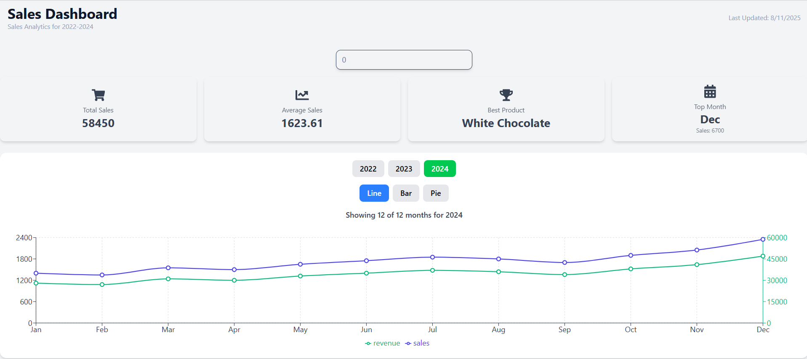
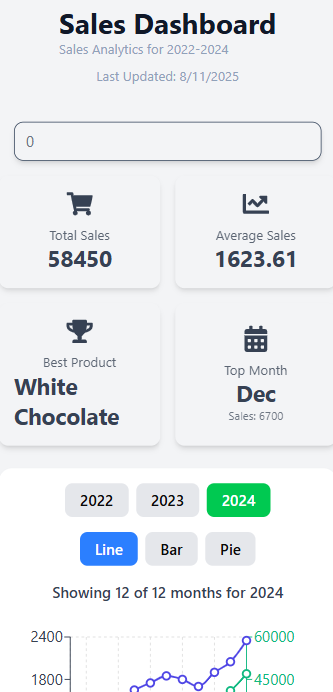

# Chocolate Sales Dashboard

A modern, responsive sales analytics dashboard built with Next.js 15, TypeScript, and Tailwind CSS, featuring interactive data visualizations for chocolate sales data from 2022-2024.


**🚀 Live Demo**
🔗 [Live Demo](https://sales-dashboard-two-xi.vercel.app/)

**📂 GitHub Repository**
🔗 [GitHub Repo](https://github.com/tsujit74/sales-dashboard)


**📸 Screenshots**

**Dashboard View**  


**Mobile View**  



## 🚀 Features

- **Interactive Charts**: Multiple chart types (Line, Bar, Pie) with seamless switching
- **Year Selection**: Filter data by specific years (2022, 2023, 2024)
- **Responsive Design**: Optimized for both desktop and mobile devices
- **Atomic Design**: Component architecture following atomic design principles
- **Real-time Updates**: Dynamic data visualization with smooth transitions
- **TypeScript**: Full type safety throughout the application

## 🏗️ Architecture

### Atomic Design Structure

The project follows atomic design principles with a clear component hierarchy:

```
src/components/
├── atoms/           # Basic building blocks
│   └── Heading.tsx
│ 
├── molecules/       # Simple combinations of atoms
│   ├── FilterInput.tsx
│   └── Kpi.tsx
├── organisms/       # Complex UI components
│   ├── KPISection.tsx
│   └── SalesCharts.tsx
└── ui/          # Specialized chart components
    ├── card.tsx
    └── tooltip.tsx
```

### Technology Stack

- **Framework**: Next.js 15 with App Router
- **Language**: TypeScript for type safety
- **Styling**: Tailwind CSS
- **Charts**: Recharts for interactive data visualization
- **Icons**: Lucide React for consistent iconography
- **Build Tool**: Turbopack for fast development builds

## 🛠️ Installation & Setup

### Prerequisites

- Node.js 18.0 or higher
- npm or yarn package manager

### Installation Steps

1. **Clone the repository**
   ```bash
   git clone https://github.com/tsujit74/sales-dashboard
   cd sales-dashboard
   ```

2. **Install dependencies**
   ```bash
   npm install
   ```

3. **Start the development server**
   ```bash
   npm run dev
   ```

4. **Open your browser**
   Navigate to `http://localhost:3000` to view the dashboard

### Available Scripts

- `npm run dev` - Start development server
- `npm run build` - Build for production
- `npm run start` - Start production server
- `npm run lint` - Run ESLint for code quality

## 📱 Usage

### Dashboard Navigation

1. **Main Dashboard**: Access via `/dashboard` route
2. **Year Selection**: Use the year buttons (2022, 2023, 2024) to filter data
3. **Chart Types**: Switch between Line, Bar, and Pie charts using the chart type buttons
4. **Interactive Elements**: Hover over chart elements for detailed tooltips

### Key Metrics

The dashboard displays four main KPIs:
- **Total Sales**: Current year sales volume
- **Best Product**: Current year Best Product
- **Average Sales**: Calculated monthly averages
- **Top Month Seles**: Month Sales

## 📈 Data Structure

### Sales Data Interface

```typescript
interface SalesData {
  month: string;
  year: number;
  sales: number;
  revenue: number;
  product: string;
}
```

## 🔧 Customization

### Modifying Data

1. Update the mock data in `src/data/salesData.ts`
2. Ensure the data structure matches the `SalesData` interface
3. Update calculations in helper functions as needed


## 🚀 Deployment

### Production Build

```bash
npm run build
npm run start
```

## 🔮 Future Enhancements

### Planned Features

- **API Integration**: Connect to real chocolate sales APIs
- **Advanced Filtering**: Date range pickers and product filters
- **Export Functionality**: PDF and CSV export capabilities
- **User Authentication**: Role-based access control
- **Real-time Data**: WebSocket integration for live updates

### Suggested Improvements

- **Performance**: Implement data virtualization for large datasets
- **Accessibility**: Enhanced ARIA labels and keyboard navigation
- **Testing**: Comprehensive unit and integration test suite
- **Analytics**: User interaction tracking and performance monitoring

## 🤝 Contributing

1. Fork the repository
2. Create a feature branch (`git checkout -b feature/amazing-feature`)
3. Commit your changes (`git commit -m 'Add some amazing feature'`)
4. Push to the branch (`git push origin feature/amazing-feature`)
5. Open a Pull Request

## 📞 Support

For questions, issues, or contributions, please:
- Open an issue on GitHub
- Contact the development team
- Check the documentation for common solutions

---

**Built with ❤️ using Next.js 15, TypeScript, and modern web technologies**

